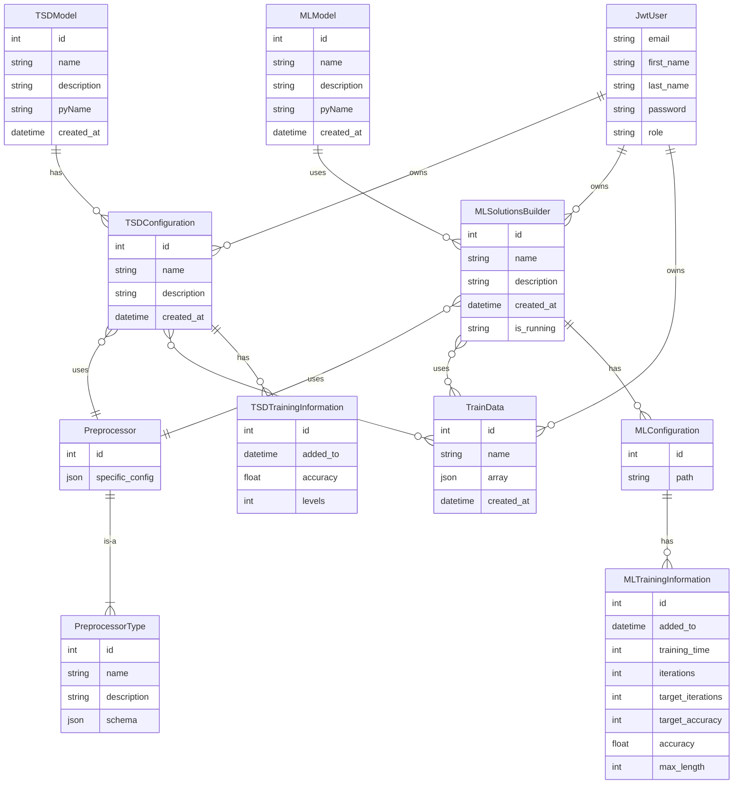

# how to save: 
``` bash
mmdc -i temp.mmd -o test.png -b weight -w 1920 -H 1920
```
```mermaid
erDiagram

    TSDLevelTrainData }o--|| TrainData : uses
    TSDConfigData ||--o{ TSDLevelTrainData : has
    TSDConfigData ||--o{ TSDConfiguration : has
    TSADataSet ||--|| TSDConfigData : has
    TSDConfiguration ||--o{ TsdConfigurationTrainData : has
    TsdConfigurationTrainData }o--|| TrainData : uses
    TsdConfigurationTrainData }o--|| TSDConfiguration : belongs_to
    
    TSDLevelTrainData {
        Long id
        jsonb levelConfig
    }

    TSDConfigData {
        Long id
    }

    TSADataSet {
        TSDConfigData tsdConfig
    }

    TrainData {
        Long id
        string name
        jsonb array
        timestamp createdAt
    }

    TSDConfiguration {
        Long id
        string name
        string description
        timestamp createdAt
    }

    TsdConfigurationTrainData {
        Long id
        jsonb levelConfig
    }
   
 ```

----------------------------
```mermaid

erDiagram
    USER ||--o{ USER_GROUPS : ""
    USER ||--o{ USER_USER_PERMISSIONS : ""
    USER ||--o{ DJANGO_ADMIN_LOG : ""
    USER ||--o{ PROJECTS : ""
    USER ||--o{ SURVEY : ""
    USER ||--o{ TOKEN_BLACKLIST_OUTSTANDINGTOKEN : ""
    USER ||--o{ TRAIN_DATA_FILE : ""
    USER ||--o{ TSD_CONFIGURATION : ""
    USER ||--o{ ML_CONFIGURATION : ""
    USER ||--o{ REFRESH_TOKEN : ""
    USER ||--o{ TRAIN_DATA : ""
    AUTH_GROUP ||--o{ USER_GROUPS : ""
    AUTH_GROUP ||--o{ AUTH_GROUP_PERMISSIONS : ""
    DJANGO_CONTENT_TYPE ||--o{ AUTH_PERMISSION : ""
    PREPROCESSOR_TYPE ||--o{ PREPROCESSOR : ""
    JSON_SCHEMAS ||--o{ DATA_TYPE : ""
    TRACKS ||--o{ PROJECTS_TRACKS : ""
    TRACKS ||--o{ TRACKS_ALLOWED_DATA_TYPES : ""
    TRACKS ||--o{ TRACKS_DATA_SETS : ""
    IMPUTATION_ALGORITHM ||--o{ TSD_CONFIGURATION : ""
    IMPUTATION_ALGORITHM ||--o{ ML_CONFIGURATION : ""
    ML_MODEL ||--o{ ML_CONFIGURATION : ""
    TSD_MODELS ||--o{ TSD_CONFIGURATION : ""
    PREPROCESSOR ||--o{ TSD_CONFIGURATION : ""
    PREPROCESSOR ||--o{ ML_CONFIGURATION : ""
    TRAIN_DATA_FILE ||--o{ TRAIN_DATA : ""
    TSD_CONFIGURATION ||--o{ TSD_TRAINING_INFORMATION : ""
    TSD_CONFIGURATION ||--o{ TSD_CONFIGURATION_TRAIN_DATA : ""
    TSD_CONFIGURATION ||--o{ TSDCONFIG_DATA : ""
    ML_CONFIGURATION ||--o{ ML_SOLUTION : ""
    ML_CONFIGURATION ||--o{ ML_CONFIG_DATA : ""
    ML_CONFIGURATION ||--o{ ML_CONFIGURATION_TRAIN_DATA : ""
    ML_SOLUTION ||--o{ ML_TRAINING_INFORMATION : ""
    TOKEN_BLACKLIST_OUTSTANDINGTOKEN ||--o{ TOKEN_BLACKLIST_BLACKLISTEDTOKEN : ""
    TSD_OPTIONS ||--o{ PLAIN_DATA : ""
    TSDCONFIG_DATA ||--o{ PLAIN_DATA : ""
    ML_CONFIG_DATA ||--o{ PLAIN_DATA : ""
    TRAIN_DATA ||--o{ TSD_CONFIGURATION_TRAIN_DATA : ""
    TRAIN_DATA ||--o{ TSD_LEVEL_TRAIN_DATA : ""
    TSD_LEVEL_TRAIN_DATA ||--o{ TSDCONFIG_DATA_TRAIN_DATA : ""
    PLAIN_DATA ||--o{ TRACKS_DATA_SETS : ""
    PLAIN_DATA ||--o{ ALPHABET : ""
    PLAIN_DATA ||--o{ DATA_SET_CUSTOM_VALUES : ""

    USER {
        int4 id PK "Primary Key"
        timestamptz last_login
        bool is_superuser
        varchar email "Unique"
        varchar first_name
        varchar last_name
        varchar password
        varchar role
        bool is_active
        bool is_staff
        varchar language_code
    }

    AUTH_GROUP {
        int4 id PK "Primary Key"
        varchar name "Unique"
    }

    DJANGO_CONTENT_TYPE {
        int4 id PK "Primary Key"
        varchar app_label
        varchar model
    }

    DJANGO_MIGRATIONS {
        int8 id PK "Primary Key"
        varchar app
        varchar name
        timestamptz applied
    }

    DJANGO_SESSION {
        varchar session_key PK "Primary Key"
        text session_data
        timestamptz expire_date
    }

    IMPUTATION_ALGORITHM {
        int4 id PK "Primary Key"
        varchar name
        varchar description
    }

    JSON_SCHEMAS {
        int8 id PK "Primary Key"
        jsonb schema
        int2 schema_type
        jsonb ui_schema
    }

    LOG_MESSAGES {
        int8 log_id PK "Primary Key"
        varchar data_set_name
        varchar message
        varchar send_session
        timestamptz time_stamp
        int8 track_id
    }

    ML_MODEL {
        int8 id PK "Primary Key"
        varchar name
        varchar description
        varchar i18n_key
        varchar pyName
        timestamptz created_at
        bool forcasting
    }

    PREPROCESSOR_TYPE {
        int4 id PK "Primary Key"
        varchar name "Unique"
        varchar description
        varchar schema_enum_value
        jsonb schema
    }

    SCHEMA_VALIDATION_FORMS {
        int8 id PK "Primary Key"
        varchar name
        jsonb schema
        jsonb ui_schema
    }

    TRACKS {
        int8 id PK "Primary Key"
        varchar name
        bool repeating
        varchar unit
    }

    TSD_MODELS {
        int8 id PK "Primary Key"
        varchar name
        varchar i18n_key
        varchar description
        varchar pyName
        varchar display_type
        timestamptz created_at
    }

    TSD_OPTIONS {
        bigserial id PK "Primary Key"
        varchar residual
        varchar season
        varchar trend
    }

    USER_GROUPS {
        int8 id PK "Primary Key"
        int8 jwtuser_id
        int4 group_id FK
    }

    AUTH_PERMISSION {
        int4 id PK "Primary Key"
        varchar name
        int4 content_type_id FK
        varchar codename
    }

    DATA_TYPE {
        varchar data_type_name PK "Primary Key"
        varchar description
        bool preview_showing
        int2 data_type
        int8 schema_id FK
    }

    DJANGO_ADMIN_LOG {
        int4 id PK "Primary Key"
        timestamptz action_time
        text object_id
        varchar object_repr
        int2 action_flag
        text change_message
        int4 content_type_id FK
        int8 user_id FK
    }

    PREPROCESSOR {
        int4 id PK "Primary Key"
        jsonb specific_config
        int4 type_id FK
    }

    PROJECTS {
        int8 id PK "Primary Key"
        varchar name
        int4 user_id FK
    }

    PROJECTS_TRACKS {
        int8 project_id PK "Composite Primary Key"
        int8 tracks_id PK "Composite Primary Key"
    }

    REFRESH_TOKEN {
        serial4 id PK "Primary Key"
        timestamptz expiry_date
        varchar token
        int4 user_id FK
    }

    SURVEY {
        int8 id PK "Primary Key"
        jsonb result
        int8 user_id FK "Unique"
    }

    TOKEN_BLACKLIST_OUTSTANDINGTOKEN {
        int8 id PK "Primary Key"
        text token
        timestamptz created_at
        timestamptz expires_at
        int8 user_id FK
        varchar jti "Unique"
    }

    USER_USER_PERMISSIONS {
        int8 id PK "Primary Key"
        int8 jwtuser_id
        int4 permission_id FK
    }

    AUTH_GROUP_PERMISSIONS {
        int8 id PK "Primary Key"
        int4 group_id FK
        int4 permission_id FK
    }

    ML_CONFIGURATION {
        int8 id PK "Primary Key"
        varchar name
        varchar description
        timestamptz created_at
        varchar is_running
        int4 min_length
        int4 imputation_algorithm_id FK
        int8 ml_model_id FK
        int4 processing_id FK
        int4 user_id FK
    }

    ML_SOLUTION {
        int8 id PK "Primary Key"
        text generator_model
        text gap_detector_model
        int8 ml_configuration_id FK "Unique"
    }

    ML_TRAINING_INFORMATION {
        int8 id PK "Primary Key"
        timestamptz added_to
        int4 training_time
        int4 iterations
        int4 target_iterations
        int4 target_accuracy
        float8 accuracy
        int4 max_length
        text image
        int4 prediction_length
        int8 ml_solution_id FK
        int4 reduction_factor
    }

    TOKEN_BLACKLIST_BLACKLISTEDTOKEN {
        int8 id PK "Primary Key"
        timestamptz blacklisted_at
        int8 token_id FK "Unique"
    }

    TRAIN_DATA {
        int8 id PK "Primary Key"
        varchar name
        jsonb time_series_value
        jsonb time_stamp_value
        timestamptz created_at
        int4 file_id FK
        int4 user_id FK
    }

    TSD_CONFIGURATION {
        int8 id PK "Primary Key"
        varchar name
        varchar description
        timestamptz created_at
        int4 min_length
        int4 imputation_algorithm_id FK
        int4 processing_id FK
        int8 tsd_model_id FK
        int4 user_id FK
    }

    TSD_TRAINING_INFORMATION {
        int4 id PK "Primary Key"
        timestamptz added_to
        float8 accuracy
        int4 levels
        int4 tsd_configuration_id FK
    }

    TSDCONFIG_DATA {
        bigserial id PK "Primary Key"
        int8 tsd_config FK
    }

    TSD_CONFIGURATION_TRAIN_DATA {
        int8 id PK "Primary Key"
        jsonb level_config
        int8 train_data_id FK
        int8 tsd_configuration_id FK
    }
    TSD-LEVEL-TRAIN-DATA {
        bigserial id PK "Primary Key"
        jsonb level_config
        int8 train_data_id
    }

    TSDCONFIG-DATA-TRAIN-DATA {
        int8 tsdconfig_data_id PK "Primary Key"
        int8 train_data_id
    }

```