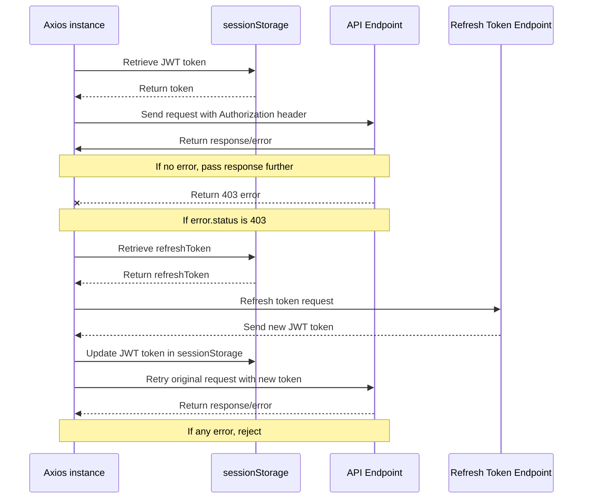
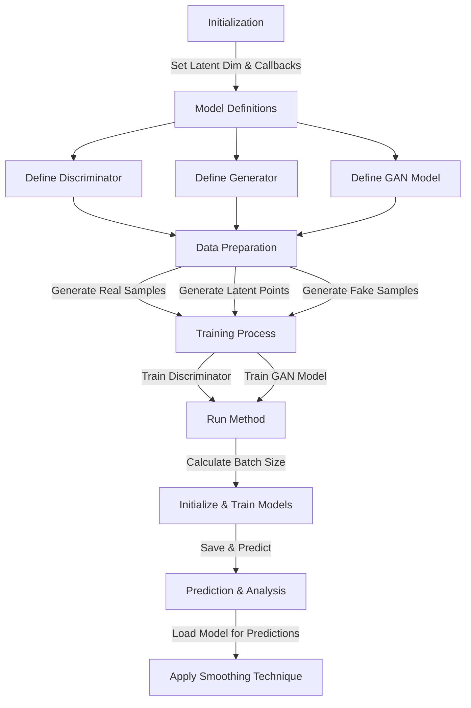
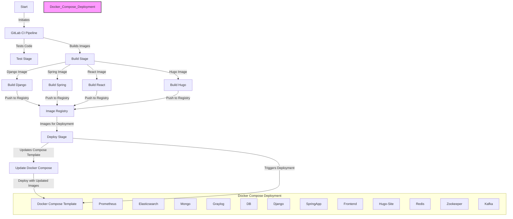

```mermaid
sequenceDiagram
  participant Axios as Axios instance
  participant Stor as sessionStorage
  participant API as API Endpoint
  participant Refr as Refresh Token Endpoint

  Axios->>Stor: Retrieve JWT token
  Stor-->>Axios: Return token 
  Axios->>API: Send request with Authorization header
  API->>Axios: Return response/error

  Note over Axios,API: If no error, pass response further

  API--xAxios: Return 403 error

  Note over Axios,API: If error.status is 403

  Axios->>Stor: Retrieve refreshToken
  Stor-->>Axios: Return refreshToken
  Axios->>Refr: Refresh token request
  Refr-->>Axios: Send new JWT token
  Axios->>Stor: Update JWT token in sessionStorage
  Axios->>API: Retry original request with new token
  API-->>Axios: Return response/error

  Note over Axios,API: If any error, reject
```
---------------------------

```mermaid
flowchart TB
    A[Initialization] -->|Set Latent Dim & Callbacks| B[Model Definitions]
    B --> C1[Define Discriminator]
    B --> C2[Define Generator]
    B --> C3[Define GAN Model]
    C1 --> D[Data Preparation]
    C2 --> D
    C3 --> D
    D -->|Generate Real Samples| E1[Training Process]
    D -->|Generate Latent Points| E1
    D -->|Generate Fake Samples| E1
    E1 -->|Train Discriminator| F1[Run Method]
    E1 -->|Train GAN Model| F1
    F1 -->|Calculate Batch Size| G[Initialize & Train Models]
    G -->|Save & Predict| H[Prediction & Analysis]
    H -->|Load Model for Predictions| I[Apply Smoothing Technique]

```

---------------------------

```mermaid
graph TB
    A[Start] -->|Initiates| B[GitLab CI Pipeline]
    
    B -->|Tests Code| C[Test Stage]

    B -->|Builds Images| D[Build Stage]
    D -->|Django Image| F[Build Django]
    D -->|Spring Image| G[Build Spring]
    D -->|React Image| H[Build React]
    D -->|Hugo Image| I[Build Hugo]

    F -->|Push to Registry| J[Image Registry]
    G -->|Push to Registry| J[Image Registry]
    H -->|Push to Registry| J[Image Registry]
    I -->|Push to Registry| J[Image Registry]

    J -->|Images for Deployment| E[Deploy Stage]
    E -->|Updates Compose Template| K[Update Docker Compose]

    subgraph Docker Compose Deployment
    L[Docker Compose Template]
    M[Prometheus]
    N[Elasticsearch]
    O[Mongo]
    P[Graylog]
    Q[DB]
    R[Django]
    S[SpringApp]
    T[Frontend]
    U[Hugo-Site]
    V[Redis]
    W[Zookeeper]
    X[Kafka]
    end

    K -->|Deploy with Updated Images| L
    E -->|Triggers Deployment| L

    style Docker_Compose_Deployment fill:#f9f,stroke:#333,stroke-width:2px

```

